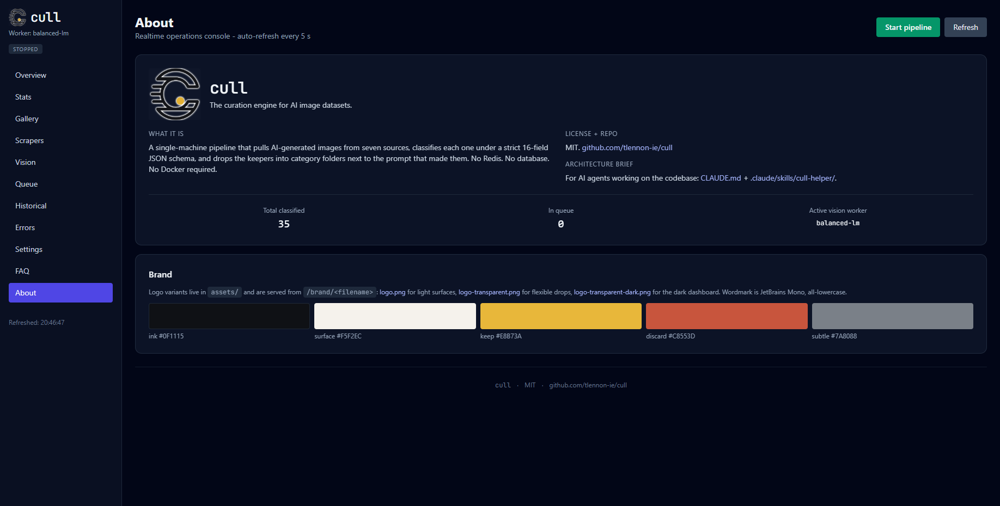
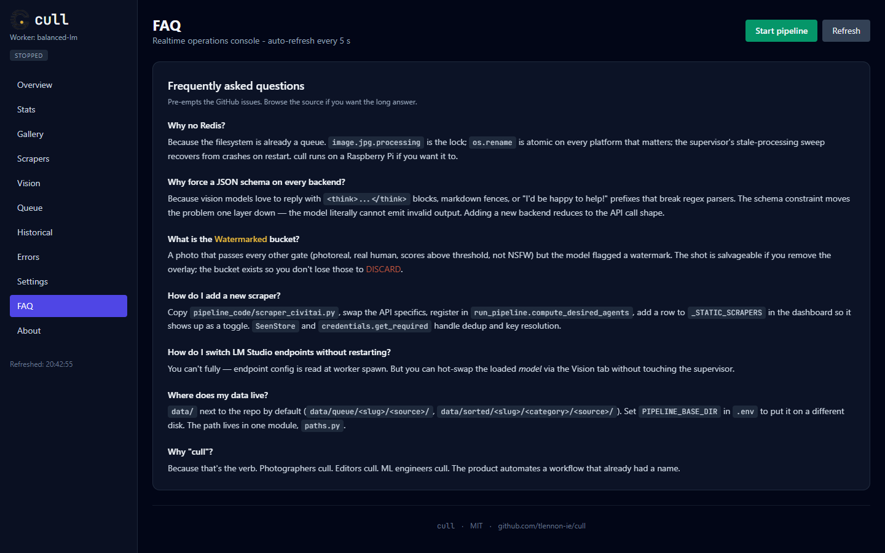

<p align="center">
  
</p>

<h1 align="center">cull</h1>
<p align="center"><em>The curation engine for AI image datasets.</em></p>

<p align="center">
  <a href="LICENSE"></a>
  <a href="https://www.python.org/"></a>
  <a href="#quick-start"></a>
  <a href="#the-dashboard"></a>
  <!-- CI badge placeholder — wire to your CI provider once the workflow lands -->
  <a href="#"></a>
  <!-- Security badge placeholder — point at your pip-audit / dependency-scan job -->
  <a href="#"></a>
</p>


<p align="center"><em>Spin up a job per dataset, queue them, and let cull work down the list.</em></p>


## What's new

- **Video lane.** yt-dlp scraper (YouTube, TikTok, X video, Reddit video, Vimeo, Bilibili) with per-job cookies + frame-level curation via a bundled `ffmpeg`. Videos play inline in the gallery modal. Toggle with `VIDEO_CLASSIFY_ENABLED` (needs the `[video]` extra).
- **First-run wizard.** New installs land on a guided flow that creates the first job, picks a preset, and verifies at least one scraper + one vision worker before turning the pipeline on.
- **Preset marketplace.** Import / export presets as portable JSON; a public gallery of curated starter presets ships with each release.
- **Kohya + HuggingFace exporters.** ZIP a filtered gallery view directly into a trainer, or push a curated set to a private HuggingFace dataset repo (`hf_export.py`).
- **Digest webhook + desktop toasts.** Job completion fires a POST to `WEBHOOK_URL` (SSRF-guarded — http/s only, no redirects) and, optionally, a local desktop notification.
- **Local vision fleet.** Multiple LM Studio / llama.cpp / Ollama endpoints run in parallel, each as its own subprocess, with gated failover and llama.cpp GBNF grammar support.
- **Security hardening.** CSP + `X-Frame-Options: DENY` + `nosniff` on every response; `safe_inside()` on every user-supplied path; `SECRET_MASK` on every credential leaving the server; `allow_redirects=False` on every outbound HTTP probe. See [`SECURITY.md`](SECURITY.md).

## What it is

cull is a single-machine curation engine for AI-generated images. It pulls from a handful of dedicated scrapers plus gallery-dl's 340+ supported sites, runs each image through a vision model under a strict 17-field JSON schema, and drops the keepers into category folders next to the prompt that made them. It is plumbing for people building image datasets by hand, with a dashboard so you can see the work. No Redis. No database. Docker optional — run it from the bootstrap scripts, `pip install -e .`, or a container, whichever you prefer.

- Pulls from dedicated sources (Civitai, X/Twitter, Reddit, Discord, local folders) plus any URL gallery-dl knows (Pixiv, DeviantArt, the booru family, ArtStation, Tumblr, Newgrounds, FurAffinity / e621, Imgur, Flickr, …). Dedupes, queues, and runs vision in one process tree.
- Forces every backend (LM Studio, Groq, anything OpenAI-compatible) into the same JSON schema so output never drifts.
- Auto-captions images that arrive without a prompt — SD/Flux prompt, Booru tags, or natural language, your pick — using the same vision call that classifies them.
- Keeps the prompt next to every image. Nothing goes through a database you don't own.

## Who it's for

- ML engineers building image datasets for LoRA / fine-tunes who want to automate the cull instead of doing it by eye.
- Solo devs maintaining a personal scrape archive across multiple sources who keep losing duplicates.
- Photographers and artists running a triage pass over hundreds of generated drafts to surface the ten worth keeping.

## Quick start

```bash
git clone https://github.com/tlennon-ie/cull.git
cd cull
./launch.sh        # Linux / macOS — installs and boots in one go
# launch.bat       # Windows
```

The launcher creates a `.venv/`, installs dependencies (including `gallery-dl` from Codeberg, so a working `git` CLI is required), copies `.env.example` to `.env` if you don't have one, then opens the dashboard at <http://localhost:5000> (it binds `0.0.0.0`; set `FLASK_PORT` to change the port, e.g. for RunPod port mapping). Idempotent — re-running is instant.

Prefer to install once and boot separately (CI, Docker layers, or just a habit)?

```bash
./install.sh                                   # Linux / macOS
install.bat                                    # Windows cmd
powershell -ExecutionPolicy Bypass -File .\install.ps1   # Windows PowerShell
```

`install.*` does the same setup work as `launch.*` and stops without booting the dashboard. Run `launch.*` (or `python pipeline_code/integrated_launcher.py` from inside the venv) when you're ready.

**RunPod / headless Ubuntu GPU box.** Bare containers often lack `python3-venv` and run as root:

```bash
apt-get update && apt-get install -y python3-venv git   # if venv / git are missing
./launch.sh
# …or skip the venv entirely on an ephemeral container:
CULL_NO_VENV=1 ./launch.sh
# map the pod's port (the dashboard binds 0.0.0.0):
FLASK_PORT=5000 ./launch.sh
```

Want to see the dashboard with mock data before configuring scrapers?

```bash
python tools/seed_demo_data.py
PIPELINE_TOPIC="Artistic Showcase" PIPELINE_SLUG=artistic_showcase \
  PIPELINE_BASE_DIR="$(pwd)/data" FLASK_PORT=5050 \
  python pipeline_code/dashboard_enhanced.py
# open http://localhost:5050
```

## Run with Docker

Docker is optional — the bootstrap scripts above need nothing else — but a container is the cleanest way to pin the runtime on a server or GPU box. The image installs the declared dependencies plus `ffmpeg` (the video lane needs it), copies the source, exposes the dashboard on `5000`, and launches the real entrypoint (`pipeline_code/integrated_launcher.py`).

```bash
docker compose up --build      # build the image and boot the dashboard
# open http://localhost:5000
```

`docker-compose.yml` bind-mounts `./data` so your queue, sorted output, prompts, and job JSON live on the host (nothing is trapped in the container), publishes `5000:5000`, and reads secrets from `.env` at run time via `env_file` — so your `GROQ_API_KEY`, cookies, and tokens never get baked into an image layer. `.dockerignore` keeps `data/`, the virtualenv, and `.env` out of the build context.

> Docker assets (`Dockerfile`, `docker-compose.yml`, `.dockerignore`) ship alongside this README; build them with the command above.

## Headless / CLI

No dashboard, no browser — drive cull from the command line on a remote GPU box. The headless CLI is a thin wrapper over the same `job_config` / supervisor APIs the dashboard uses, so it never reimplements job state. Once installed (`pip install -e .`, see below) the `cull` command is on your `PATH`:

```bash
cull job create lora_faces --subject "studio portrait photography"   # create a job from the default preset
cull jobs activate lora_faces                                        # project its env + categories
cull jobs list                                                       # list jobs (active one is starred)
cull presets list                                                    # list the starter preset library
cull status                                                          # active job + queue/sorted counts
cull run                                                             # start the supervisor (runs the active job)
```

Prefer not to install? Every subcommand also runs straight from the source tree inside the venv:

```bash
python pipeline_code/cull_cli.py jobs list
python pipeline_code/cull_cli.py job create lora_faces --subject "studio portrait photography"
python pipeline_code/cull_cli.py run
```

## Optional extras

The base install stays lean — heavy or provider-specific dependencies are split into [PEP 621](https://peps.python.org/pep-0621/) extras in [`pyproject.toml`](pyproject.toml). Install only what a given job needs:

```bash
pip install -e .             # base runtime (dashboard, scrapers, local + Groq vision)
pip install -e ".[cloud]"    # OpenAI / Anthropic / Gemini cloud vision SDKs
pip install -e ".[video]"    # scenedetect + ffmpeg-python (video frame extraction)
pip install -e ".[ml]"       # torch + open_clip_torch (embeddings, aesthetic prefilter)
pip install -e ".[dev]"      # pytest + ruff + pip-audit (tests, lint, security audit)
```

Combine them in one shot, e.g. `pip install -e ".[cloud,dev]"`. The `launch.*` / `install.*` bootstrap scripts remain the zero-config path and install `requirements.txt`; `pip install -e .` is the standards-based alternative that also exposes the extras and the `cull` console command.

> **Known limitation.** `gallery-dl` is pinned to a Codeberg git tag in `requirements.txt`; a direct VCS URL can't live in a publishable `[project.dependencies]` entry, so it is installed via `requirements.txt` (or the bootstrap scripts) rather than duplicated in `pyproject.toml`. Run `pip install -r requirements.txt` once for the URL-based scraper if you installed only with `pip install -e .`.

## How it works

```
sources                queue                 vision worker            sorted
──────                 ─────                 ─────────────            ──────
civitai      ──┐
twitter/x    ──┤      data/queue/<src>/      base64 + JSON schema     data/sorted/<cat>/<src>/
reddit       ──┼─►    atomic .processing  ─► strict 16-field output ─► image + .txt + .vision.json
discord      ──┤      lock per file          OVR + REL scoring
local folder ──┘                             post-hoc validation
```

Every image keeps its `.txt` prompt and gains a `.vision.json` audit record. The supervisor crash-recovers stuck `.processing` files on restart. The atomic-rename is the cross-worker lock — losers of the race short-circuit cleanly.

## Use cases

**Curating LoRA training data.** Point the Civitai + X scrapers at your topic, set OVR/REL minimums in the dashboard, let the keepers land in `Professional/` and `InstagramInfluencer/`. ZIP-export the filtered view straight into your trainer.

**Deduping a scraped archive across sources.** Every scraper shares dedup state through a per-source `seen_*.json`. Add a local folder to the job and the same image showing up on civitai and a twitter repost gets caught by content hash, not filename.

**Building a tagged personal library.** Edit prompts inline from the gallery modal — overwrites the `.txt` next to the image, invalidates the keyword cache, refreshes stats. Filter by score, date, source, resolution. Click any chip to jump straight to a filtered view.

**Ingesting prompt-less archives.** Toggle off the prompt requirement, paste a list of gallery-dl URLs (or point `LOCAL_IMPORT_DIR` at a folder of bare JPEGs), and turn on auto-captioning in the Vision tab. Every image that lands in the queue gets a SD-prompt / Booru-tags / natural-language `.txt` written by the same LLM call that classifies it — so you can train a LoRA on a years-old archive without curating prompts by hand.

## Plug it

Adding a new vision provider is a 30-line subclass:

```python
# vision_worker_anthropic.py
from vision_worker_base import BaseVisionWorker, build_response_format, run_subclass

class AnthropicWorker(BaseVisionWorker):
    name = "anthropic-claude"
    parallel_workers = 4

    def classify_image_bytes(self, b64_jpeg, prompt_instruction):
        # call Anthropic with the image + prompt + response_format=build_response_format()
        # return the parsed JSON dict, or None to trigger RETRY
        ...
```

Adding a new scraper source is similar — `SeenStore("name", slug=SLUG)` for dedup, `credentials.get_required("KEY", scraper="name")` for keys, `queue_manager.save_to_queue(source, tmp_path, prompt, meta)` for output. See [`CLAUDE.md`](CLAUDE.md) for the full contract or [`.claude/skills/cull-helper/SKILL.md`](.claude/skills/cull-helper/SKILL.md) if your AI agent should write the code.

For URL-based sources, you don't need to write a scraper at all — paste the URL into the **gallery-dl** scraper card in Settings (Pixiv, DeviantArt, Danbooru, e621, ArtStation, Tumblr, Newgrounds, FurAffinity, X, Reddit, Imgur, Flickr — [340+ sites supported](https://codeberg.org/mikf/gallery-dl#supported-sites)). gallery-dl's metadata postprocessor extracts `description` / `caption` / `selftext` / `tags` and cull writes that as the image's `.txt` automatically. Cookies file required for sites gated behind login (Pixiv, X, Patreon).

## Jobs

cull is **job-centric**. A *job* is a named curation target — one subject, its scraper targets, its categories and judgement rules, its scoring and captioning. Keep several around (a LoRA dataset, a personal archive, an ad-image pull) and run them one at a time.

**Presets + inherit-by-default.** Shared config lives in a **preset library** (`data/jobs/_presets.json`). A job picks a preset and **inherits everything**; you only override the fields you want to change for that job. Every field in the editor shows its effective value with a "global" chip when it's inherited and a "reset to global" affordance once you override it — so a job file stays tiny (just its `subject` + the handful of overridden leaves). Edit the preset to change the default for every job that inherits it. Hover the ⓘ next to any field for guidance and example values.

cull ships a **starter preset library** so a new job lands on sensible defaults: a general `default` (a topic-agnostic Keep / Borderline / OffTopic triage with **no** person/subject gates) plus themed starters for **aerial/drone**, **underwater**, **wildlife & macro**, **product**, and **anime/illustration** — with a **photoreal-portrait** and a **quality-only** preset retained. Clone any of them and tweak its categories, judgement rules, scoring and topic filters.

**Auto-saving.** Job and preset settings save themselves as you type — there are no Save buttons. For the job that's currently running, your edits are held and **applied when you leave the editor** (or hit Apply), so the pipeline re-projects and restarts once instead of on every keystroke.

The dashboard opens on a grid of **job cards** (name, status, queue position, queued/sorted counts). Open a job to get its own workspace — **Historical**, **Queue**, **Scrapers** (per-job on/off + targets), **Vision** (this job's captioning + score gates), **Stats**, and **Settings** (the job editor: subject, keywords, subreddits, X accounts, Discord channels, gallery-dl URLs, local folders, categories, scoring, captioning). Jobs run sequentially: activate one, queue the rest, and cull advances down the queue.

**Multiple local folders.** A job can pull from any number of local folders at once — add them as a list in the job's Scrapers/Settings (each with its own name and optional dedup-migration). The old single-folder importer is folded into this one list.

Each job is a plain JSON file at `data/jobs/<slug>.json` — just `subject`, the chosen `preset`, and a sparse `overrides` map (queue order + active pointer in `data/jobs/_index.json`, the preset library in `data/jobs/_presets.json`). Diff-able, version-able, nothing in a database you don't own.

**Global Settings** (reached from the jobs grid) holds the things shared across every job: credentials (Groq / Civitai / Twitter cookies / Discord token / Reddit), model endpoints (LM Studio / OpenAI-compatible / Ollama / Groq), which vision worker runs, throttle, and storage paths.

### Upgrading from a pre-jobs version

If you're coming from an older cull where everything lived in a flat `.env`, run the one-shot migration from the repo root (inside the venv):

```bash
python tools/migrate_to_jobs.py
```

It seeds a `default` preset, captures your current `.env` as a `default` job (its settings stored as that job's overrides), and adopts any other slug already on disk as its own job — folding any legacy local-folder settings into the new local-folders list. **Your existing `data/queue/<slug>` and `data/sorted/<slug>` folders are not moved or touched** — the migration only writes the new job/preset JSON, so nothing is lost. It's safe to re-run (idempotent); the dashboard and supervisor also auto-create the `default` job on first launch if you skip the script, and old v1 job files auto-upgrade when read. Your old per-job `.env` keys become legacy seeds — once a job is active, its config takes over.

## The dashboard

Single-file Flask + Alpine.js, zero build step. The jobs grid is the landing surface; open a job for its scoped tabs. Auto-refreshes every 5 seconds.

| | |
|---|---|
|  |  |
| **Overview** — queue and sorted totals, recent classifications, queue-by-source | **Stats** — top keywords, three top-10 leaderboards, per-source DISCARD / NSFW / quality |
|  |  |
| **Gallery** — filterable grid, score / date / source / resolution / NSFW filters, ZIP export of the current view, n-gram insights, click-to-edit prompts | **Scrapers** — per-source on/off toggles, scoped to the open job |
|  |  |
| **About** — what cull is, repo + license, live counters, brand palette swatches | **FAQ** — pre-empts the GitHub issues (Why no Redis · Why force a JSON schema · What is "Watermarked" · How to add a scraper · How to switch LM Studio · Where data lives · Why "cull") |

The Gallery detail modal lets you edit the prompt and save. The save overwrites the `.txt` next to the image with no backup, by design — versioning belongs in git, not in a thousand `.txt.bak` files.

## Architecture in one screen

| Concern | Single source of truth |
|---|---|
| Categories | [`pipeline_code/categories.py`](pipeline_code/categories.py) |
| Vision worker registration | [`pipeline_code/vision_workers.py`](pipeline_code/vision_workers.py) |
| Vision worker scaffolding | [`pipeline_code/vision_worker_base.py`](pipeline_code/vision_worker_base.py) |
| Filesystem paths | [`pipeline_code/paths.py`](pipeline_code/paths.py) |
| Queue (Protocol + FSQueue impl) | [`pipeline_code/queue_manager.py`](pipeline_code/queue_manager.py) |
| Per-source dedup | [`pipeline_code/seen_store.py`](pipeline_code/seen_store.py) |
| Credential resolution | [`pipeline_code/credentials.py`](pipeline_code/credentials.py) |
| Logging | [`pipeline_code/pipeline_logging.py`](pipeline_code/pipeline_logging.py) |
| Classification prompt + JSON schema | [`pipeline_code/vision_prompt.py`](pipeline_code/vision_prompt.py) |

Every concern has exactly one canonical module. Adding categories, vision providers, or scrapers means editing one file.

## Configuration

Global settings (credentials, model endpoints, vision worker selection, throttle, storage paths) live in `.env` — the dashboard's **Global Settings** edits the same file from the browser. Everything else is **per-job**: a job inherits a preset (`data/jobs/_presets.json`) and stores only its overrides (`data/jobs/<slug>.json`), edited in the job's own Settings/Vision tabs. The keys below are the env names those per-job fields project to at runtime (and the legacy `.env` values that seed the `default` job/preset on first upgrade).

Global credentials — required only for the providers you'll use:

- `GROQ_API_KEY` — for the `balanced-groq` worker (cloud, fast, handles NSFW)
- `LMSTUDIO_PRIMARY_URL` — for `balanced-lm` / `lm-autodetect` (defaults to `http://127.0.0.1:1234`)
- `CIVITAI_API_KEY` — for the Civitai scrapers
- `TWITTER_COOKIES` — for X/Twitter (cookie-based, no OAuth)
- `DISCORD_BOT_TOKEN` + `DISCORD_CHANNELS_JSON` — for Discord

Quality thresholds:

- `VISION_OVR_MIN_SCORE` — minimum craft-quality score (0-100) below which images go to DISCARD.
- `VISION_REL_MIN_SCORE` — minimum topic-relevance score (0-100). Same threshold semantics.

Neither applies to images classified as NSFW — those land in the `NSFW/` bucket regardless of score.

Prompt-less ingest + auto-captioning (Vision tab toggles, also `.env` keys):

- `REQUIRE_PROMPT` — `true` (default) keeps the existing `MIN_PROMPT_LENGTH` gate; set `false` to let scrapers queue images that have no prompt at all (gallery-dl, local folders, etc.).
- `AUTO_CAPTION_ENABLED` — when `true`, the vision worker emits a training-ready caption in the same call that classifies the image. The caption gets written to the image's `.txt`.
- `AUTO_CAPTION_STYLE` — one of `sd_prompt` (default, comma-separated SD/Flux prompt), `booru_tags` (lowercase_underscored), or `natural_language` (1-3 sentences).
- `AUTO_CAPTION_OVERWRITE` — `false` (default) preserves an existing source-side prompt; `true` regenerates `.txt` for every image regardless.

gallery-dl scraper:

- `GALLERY_DL_ENABLED` — toggle for the URL-based scraper backed by [gallery-dl](https://codeberg.org/mikf/gallery-dl).
- `GALLERY_DL_URLS` — newline or comma separated URLs (Pixiv profiles, booru tag pages, DeviantArt galleries, etc.).
- `GALLERY_DL_LIMIT_PER_URL` — cap per URL (default 50).
- `GALLERY_DL_COOKIES_FILE` — Netscape `cookies.txt` path; required for login-walled sites.
- `GALLERY_DL_CONFIG_PATH` — optional extra gallery-dl JSON config layered on top of cull's defaults.

## Security posture

cull is a **single-user local admin tool**. The dashboard trusts anyone who can
reach its port. If that's just you on your own machine, you're fine; if the
port is exposed to a network you don't trust, put a reverse proxy with auth in
front of it, or bind loopback-only:

```env
# .env
FLASK_HOST=127.0.0.1
```

The dashboard ships with CSP, `X-Frame-Options: DENY`, `X-Content-Type-Options: nosniff`,
`Referrer-Policy: no-referrer`, and a restrictive `Permissions-Policy` on every
response; every user-supplied path is validated with `safe_inside()`; every set
credential returns as `********`; every outbound HTTP probe passes
`allow_redirects=False`. Full threat model in [`SECURITY.md`](SECURITY.md).

**Please scrape politely.** cull's scrapers hit public APIs and pages — respect
each site's `robots.txt` and Terms of Service, don't burst-scrape, and add
sensible rate limits via the `RATE_LIMIT_<SOURCE>_*` env vars for the sources
you push hardest. gallery-dl and yt-dlp inherit the same responsibility.

## FAQ

**Why no Redis?** Because the filesystem is already a queue. `image.jpg.processing` is the lock; `os.rename` is atomic on every platform that matters; the supervisor's stale-processing sweep recovers from crashes on restart. cull runs on a Raspberry Pi if you want it to.

**Why force a JSON schema on every backend?** Because vision models love to reply with `<think>...</think>` blocks, markdown fences, or "I'd be happy to help!" prefixes that break regex parsers. The schema constraint moves the problem one layer down — the model literally cannot emit invalid output. Adding a new backend is reduced to the API call shape.

**What is the "Watermarked" category?** A photo that passes every other gate (photoreal, real human, scores above threshold, not NSFW) but the model flagged a watermark. The shot is salvageable if you remove the overlay; the bucket exists so you don't lose those to DISCARD. (It belongs to the retained `photoreal_portrait` preset — the general `default` and themed presets use their own buckets.)

**What presets ship with cull, and how do I start a job?** A new job inherits the general `default` preset — a topic-agnostic Keep / Borderline / OffTopic triage with no person or subject gates. The Presets tab also ships themed starters (aerial/drone, underwater, wildlife & macro, product, anime/illustration) plus a photoreal-portrait and a quality-only preset. Pick one when you create the job, or clone any preset and tweak its categories, judgement rules, scoring and topic filters. Hover the ⓘ next to a field for guidance and example values.

**How do I check a scraper's credentials actually work?** Every scraper with auth has a **Test connection** button — next to its credential in Global Settings (Civitai, X/Twitter, Reddit, Discord) and on each row of a job's Scrapers tab. It makes a real, cheap authenticated call and reports ✓/✗ with latency, so you can confirm a key, cookie, or token before kicking off a run — you can even test a freshly typed credential before saving it.

**How do I add a new scraper?** Copy `pipeline_code/scraper_civitai.py`, swap the API specifics, register in `run_pipeline.compute_desired_agents`, add a row in `_STATIC_SCRAPERS` so it shows up as a toggle. The `SeenStore` and `credentials` helpers handle dedup and key resolution.

**How do I switch LM Studio endpoints without restarting?** You can't fully — endpoint config is read at worker spawn. But you can hot-swap the loaded *model* via the dashboard's Vision tab without touching the supervisor.

**Where does my data live?** `data/` next to the repo by default (`data/queue/<slug>/<source>/`, `data/sorted/<slug>/<category>/<source>/`). Set `PIPELINE_BASE_DIR` in `.env` to put it on a different disk. The path lives in one module, [`paths.py`](pipeline_code/paths.py).

**Why "cull"?** Because that's the verb. Photographers cull. Editors cull. ML engineers cull. The product automates a workflow that already had a name.

## Contributing

Small fixes welcome. For larger changes (new scraper source, new vision provider) please open an issue first. Full guide: [`CONTRIBUTING.md`](CONTRIBUTING.md). By participating you agree to the [`Code of Conduct`](CODE_OF_CONDUCT.md). Security issues: [`SECURITY.md`](SECURITY.md) (please email, don't file a public issue).

### Working with an AI coding agent

This repo ships a Claude-style skill for AI coding agents at [`.claude/skills/cull-helper/SKILL.md`](.claude/skills/cull-helper/SKILL.md) and a high-level architecture brief at [`CLAUDE.md`](CLAUDE.md). Point Claude Code, Cursor, Aider, Codex, or any agent that respects those files at the repo and they'll know the load-bearing seams (categories, vision-worker registry, queue protocol, seen-store, credentials helpers) before touching anything.

## Brand assets

Three variants in [`assets/`](assets/), all 600×600 PNG:

| File | Background | Use for |
|---|---|---|
| [`logo.png`](assets/logo.png) | warm off-white `#F5F2EC` | README, GitHub social card, light surfaces |
| [`logo-transparent.png`](assets/logo.png) | transparent w/ paper backdrop | flexible drop on light/medium surfaces |
| [`logo-transparent-dark.png`](assets/logo-transparent-dark.png) | fully transparent | dark UI, dashboard nav, favicon |

Palette: ink `#0F1115` · surface `#F5F2EC` · keep accent `#E8B73A` · discard `#C8553D` · subtle `#7A8088`. Wordmark in JetBrains Mono, all-lowercase. The dashboard exposes the live brand pack at `/brand/<filename>` so you can hot-reload variants without touching the HTML.

## Acknowledgements

cull stands on the shoulders of several open-source projects that do the actual heavy lifting.

- **[gallery-dl](https://codeberg.org/mikf/gallery-dl)** by **[Mike Fährmann (@mikf)](https://codeberg.org/mikf)** — the universal scraper backing cull's URL-based ingest. Without it, cull would need a per-site extractor for every Pixiv / DeviantArt / booru / Tumblr / Newgrounds / FurAffinity / e621 / Imgur / Flickr / ArtStation / Reddit / X feed. Pinned to a tagged release so cull's behaviour doesn't drift when upstream evolves an extractor.
- **[Civitai](https://civitai.com)** — primary source of generation-prompt-attached images on the open web. cull's Civitai scrapers run against both `civitai.com` and `civitai.red`.
- **[LM Studio](https://lmstudio.ai)** — local-first model hosting with a clean OpenAI-compatible REST surface. Two of cull's vision workers target it directly; the strict-output schema and JIT load/unload story both rely on LM Studio features.
- **[Groq](https://groq.com)** — fast cloud-hosted vision (Llama-4-Scout) for users without the hardware to run a local VL model.
- **[Playwright](https://playwright.dev)**, **[Flask](https://flask.palletsprojects.com)**, **[Alpine.js](https://alpinejs.dev)**, **[Pillow](https://python-pillow.org)** — the supporting stack.

If you build on cull, please keep the credit chain intact when you fork.

## License

MIT — see [LICENSE](LICENSE).

### Attribution

If you fork, embed, repackage, or build a derivative tool on top of cull (paid or free), please credit the original work in your README, About page, or equivalent surface, and link back to this repository. Suggested wording:

> Built on / inspired by [cull](https://github.com/tlennon-ie/cull) by Thomas Lennon — MIT licensed.

The MIT license already requires that the copyright notice and license text be retained in any redistributions or derivative works; this section just spells out the spirit. If you publish a write-up, video, or paper that demonstrates cull, a link back is appreciated. If you'd like to sponsor continued development, see [Sponsor](https://github.com/sponsors/tlennon-ie) on the repository.
