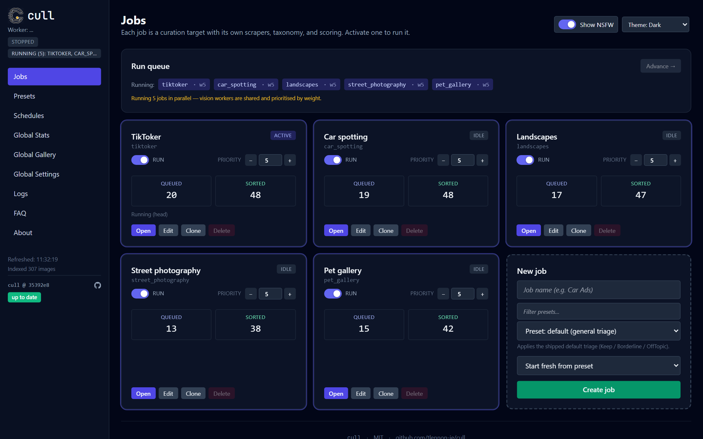
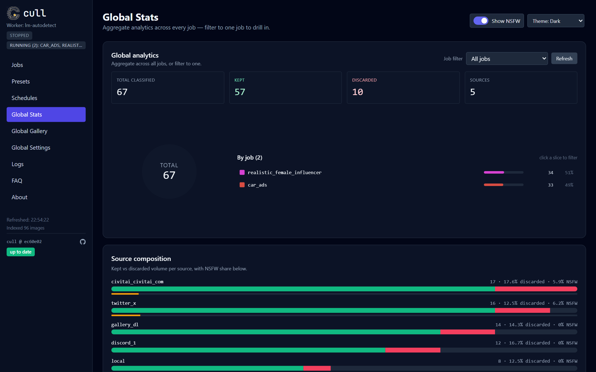
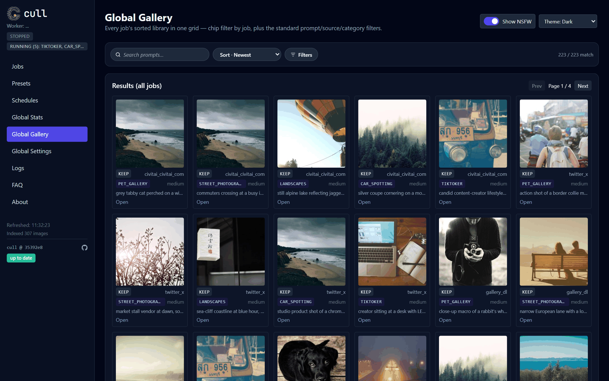
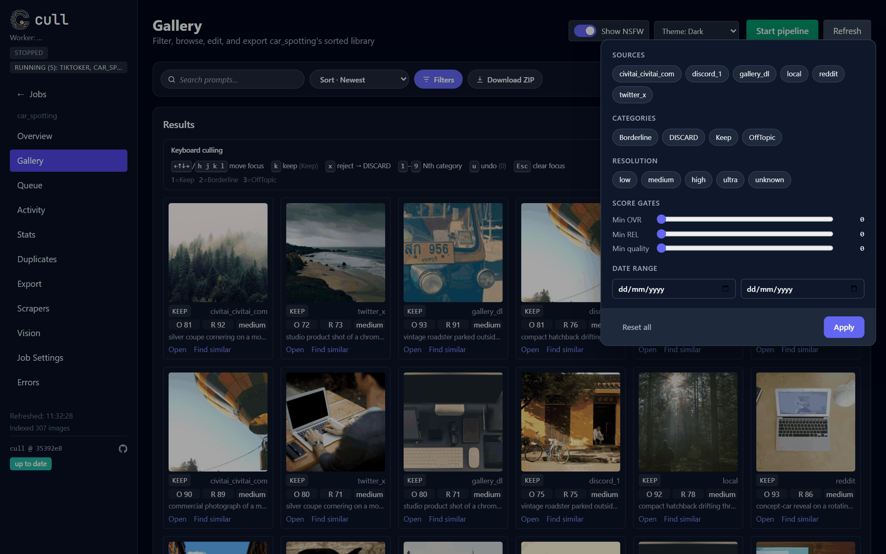
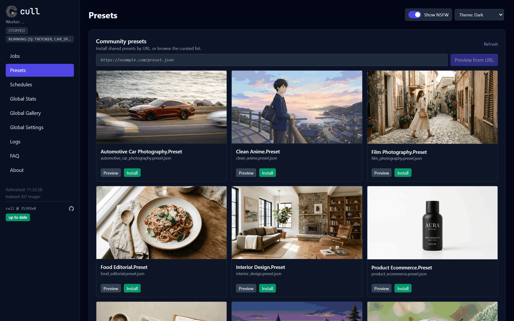
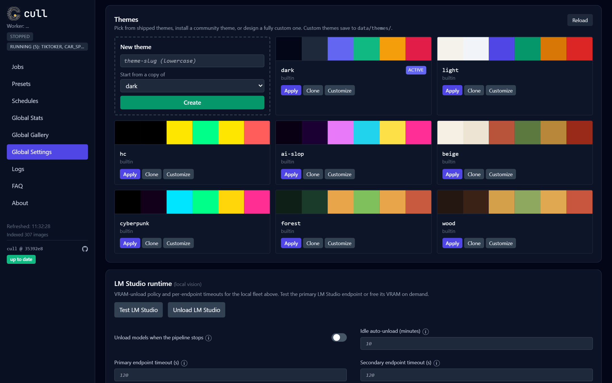
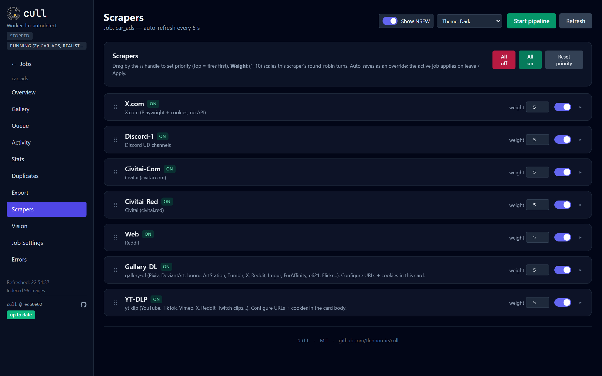
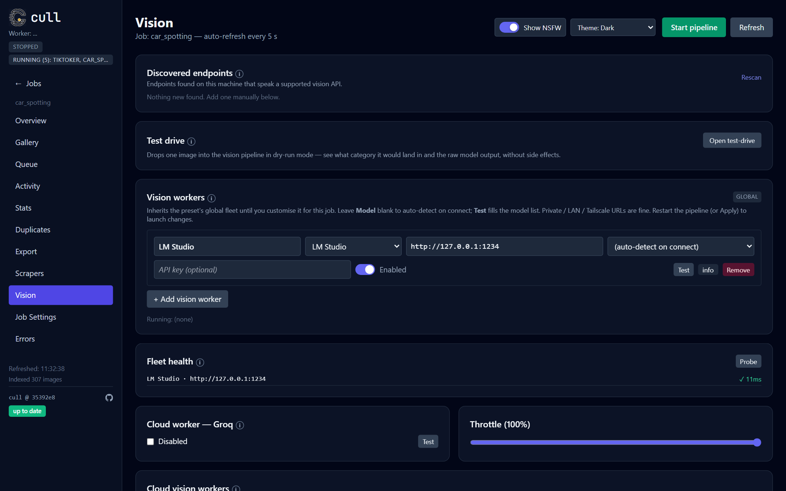

<p align="center">
  
</p>

<h1 align="center">cull</h1>
<p align="center"><em>The curation engine for AI image + video datasets.</em></p>

<p align="center">
  <a href="https://github.com/tlennon-ie/cull/actions/workflows/ci.yml"></a>
  <a href="https://github.com/tlennon-ie/cull/actions/workflows/security.yml"></a>
  <a href="https://github.com/tlennon-ie/cull/pkgs/container/cull"></a>
  <a href="LICENSE"></a>
</p>

<p align="center">
  
</p>

## Install

Pick one — all three land you at [http://localhost:5000](http://localhost:5000).

**Docker (any OS):**

```bash
docker run --rm -p 5000:5000 -v "$PWD/data:/data" ghcr.io/tlennon-ie/cull:latest
```

**macOS / Linux:**

```bash
git clone https://github.com/tlennon-ie/cull && cd cull && ./launch.sh
```

**Windows:**

```powershell
git clone https://github.com/tlennon-ie/cull
cd cull
.\launch.bat
```

The launchers create `.venv/`, install deps (needs `git` on PATH for `gallery-dl`), copy `.env.example` → `.env`, and boot the dashboard. Re-running is idempotent.

## What it is

Scrape → dedupe → vision-classify → sort → export, all on one machine. Point cull at Civitai, Reddit, X, Discord, any URL `gallery-dl` or `yt-dlp` knows, or local folders. It queues everything, runs a vision-language model (LM Studio, Ollama, Groq, OpenAI — pick any, or run several in parallel) with a strict JSON schema, and drops kept images into category folders alongside their prompt (`.txt`) and audit record (`.vision.json`).

The dashboard at `http://localhost:5000` gives you multi-job parallelism, live counters, filter chips, a preset marketplace, a theme editor, and one-click export to Kohya or HuggingFace. Everything on disk is plain files — no database you don't own.

## Screenshots

Every shot below is from a synthetic demo dataset. Reproduce it locally with `python tools/fetch_demo_samples.py && python tools/seed_demo_data.py`.

| | |
|---|---|
|  |  |
| **Jobs** — run 5 curation targets in parallel | **Global Stats** — donut + kept/discarded bars, live |
|  |  |
| **Gallery** — every job's kept output in one grid | **Filters** — source, category, score, date — one popover |
|  |  |
| **Presets** — built-in + community, publish via PR | **Themes** — 8 built-ins + full color-picker editor |
|  |  |
| **Scrapers** — all sources on one tab | **Vision** — local + cloud workers, tested per row |

## How it works

```
sources               queue                    vision fleet             sorted
──────                ─────                    ────────────             ──────
civitai   ─┐
x.com     ─┤    data/queue/<slug>/<src>/       LM Studio · Ollama       data/sorted/<slug>/<cat>/<src>/
reddit    ─┼─►  atomic .processing lock    ─►  Groq · OpenAI · …    ─►  image + .txt + .vision.json
discord   ─┤    per-source SeenStore dedup     strict-JSON schema       Kohya / HuggingFace export
gallery-dl ┤                                   OVR + REL score gates
yt-dlp    ─┤
local     ─┘
```

Every image keeps its prompt and gains an audit record. The atomic `.processing` rename is the cross-worker lock — losers of the race short-circuit cleanly. Full contract in [`CLAUDE.md`](CLAUDE.md).

## More install options

<details>
<summary><strong>Docker Compose (bind-mount + persistent env)</strong></summary>

```bash
git clone https://github.com/tlennon-ie/cull && cd cull
cp .env.example .env    # fill in GROQ_API_KEY, cookies, etc.
docker compose up -d
```

`docker-compose.yml` bind-mounts `./data`, reads secrets from `.env` at runtime (never baked into the image), and publishes `5000:5000`. Stop with `docker compose down`.

</details>

<details>
<summary><strong>Headless / CLI (remote GPU box)</strong></summary>

After `pip install -e .` the `cull` command is on your PATH:

```bash
cull job create lora_faces --subject "studio portrait photography"
cull jobs activate lora_faces
cull run                    # start the supervisor
cull status                 # active job + queue/sorted counts
cull jobs list
```

</details>

<details>
<summary><strong>Demo mode (real photos, fake stats)</strong></summary>

```bash
python tools/fetch_demo_samples.py    # one-time: cache ~40 SFW photos from picsum.photos
python tools/seed_demo_data.py        # seed 5 demo jobs (idempotent)
python tools/seed_demo_data.py --reset  # wipe + reseed
```

Sample photos are cached under `docs/mock-data/samples/` — the seeder itself never hits the network. Each demo item ships with a real prompt + a `.vision.json` sidecar so the gallery, stats, donut, and activity feed all populate.

</details>

<details>
<summary><strong>RunPod / bare Ubuntu GPU box</strong></summary>

```bash
apt-get update && apt-get install -y python3-venv git   # if venv / git are missing
./launch.sh
# …or skip the venv on an ephemeral container:
CULL_NO_VENV=1 ./launch.sh
# map the pod's port (the dashboard binds 0.0.0.0):
FLASK_PORT=5000 ./launch.sh
```

</details>

<details>
<summary><strong>Optional pip extras</strong></summary>

```bash
pip install -e .             # base: dashboard, scrapers, local + Groq vision
pip install -e ".[cloud]"    # OpenAI / Anthropic / Gemini SDKs
pip install -e ".[video]"    # scenedetect + ffmpeg-python (video frame extraction)
pip install -e ".[ml]"       # torch + open_clip_torch (embeddings, aesthetic prefilter)
pip install -e ".[dev]"      # pytest + ruff + pip-audit
```

Combine them: `pip install -e ".[cloud,dev]"`. `gallery-dl` is pinned to a Codeberg git tag in `requirements.txt` (VCS URLs can't live in `[project.dependencies]`), so run `pip install -r requirements.txt` once for URL-based scrapers if you skipped the launcher.

</details>

## Configuration

Global settings (`.env`) hold credentials, model endpoints, and storage paths — edit from the dashboard's **Global Settings** tab or the file directly. Everything else is **per-job**: a job inherits a preset (`data/jobs/_presets.json`) and stores only its overrides (`data/jobs/<slug>.json`).

The most-touched env keys:

- `GROQ_API_KEY` · `LMSTUDIO_PRIMARY_URL` · `CIVITAI_API_KEY` · `TWITTER_COOKIES` · `DISCORD_BOT_TOKEN`
- `VISION_OVR_MIN_SCORE` / `VISION_REL_MIN_SCORE` — quality + relevance gates (0–100)
- `REQUIRE_PROMPT` — set `false` to accept prompt-less images and auto-caption them
- `AUTO_CAPTION_ENABLED` + `AUTO_CAPTION_STYLE` (`sd_prompt` | `booru_tags` | `natural_language`)
- `PIPELINE_BASE_DIR` — where cull keeps queue / sorted / logs / jobs (default `./data/`)

Full list in [`.env.example`](.env.example).

## Upgrading

<details>
<summary><strong>From a pre-jobs cull (flat .env)</strong></summary>

```bash
python tools/migrate_to_jobs.py            # apply (default; idempotent)
python tools/migrate_to_jobs.py --dry-run  # preview only
```

Seeds a `default` preset, captures your `.env` as a `default` job (its settings become that job's overrides), and adopts any other slug already on disk as its own job. **Your existing `data/queue/<slug>` and `data/sorted/<slug>` folders are never moved or touched.**

</details>

<details>
<summary><strong>From an older main (user-acquisition wave)</strong></summary>

```bash
python tools/migrate_wave.py             # dry-run audit
python tools/migrate_wave.py --apply     # run idempotent migrations
```

Everything read-tolerant: jobs, presets, schedules, and legacy single-endpoint vision env vars auto-fold into the default preset's fleet on first start. The SQLite index is unchanged; pre-existing rows keep working.

</details>

## Security

cull is a **single-user local admin tool** — the dashboard trusts anyone who can reach its port. If that's just you, you're fine; if the port is exposed to an untrusted network, put a reverse proxy with auth in front of it or bind loopback-only via `FLASK_HOST=127.0.0.1`.

Full threat model + response policy in [`SECURITY.md`](SECURITY.md). Please email — don't file a public issue — for security reports.

**Scrape politely.** cull hits public APIs; respect each site's `robots.txt` and Terms of Service, and set `RATE_LIMIT_<SOURCE>_*` env vars for the sources you push hardest.

## Contributing

Small fixes welcome. For larger changes (new scraper, new vision provider) please open an issue first. Full guide: [`CONTRIBUTING.md`](CONTRIBUTING.md).

**Working with an AI agent?** [`CLAUDE.md`](CLAUDE.md) is the architecture brief; [`.claude/skills/cull-helper/SKILL.md`](.claude/skills/cull-helper/SKILL.md) is a drop-in skill for Claude Code, Cursor, Aider, Codex, and friends.

<details>
<summary><strong>Acknowledgements</strong></summary>

- **[gallery-dl](https://codeberg.org/mikf/gallery-dl)** by **[Mike Fährmann](https://codeberg.org/mikf)** — the universal scraper backing URL-based ingest.
- **[Civitai](https://civitai.com)** — primary source of prompt-attached AI images.
- **[LM Studio](https://lmstudio.ai)** — local-first VLM hosting with an OpenAI-compatible REST surface.
- **[Groq](https://groq.com)** — fast cloud VLM (Llama-4-Scout) for users without local GPU.
- **[Playwright](https://playwright.dev)** · **[Flask](https://flask.palletsprojects.com)** · **[Alpine.js](https://alpinejs.dev)** · **[Pillow](https://python-pillow.org)** — the supporting stack.

If you fork, please keep the credit chain intact.

</details>

## License

MIT — see [LICENSE](LICENSE). If you fork or repackage, credit the original: *Built on / inspired by [cull](https://github.com/tlennon-ie/cull) by Thomas Lennon — MIT licensed.* Sponsors welcome at [github.com/sponsors/tlennon-ie](https://github.com/sponsors/tlennon-ie).
