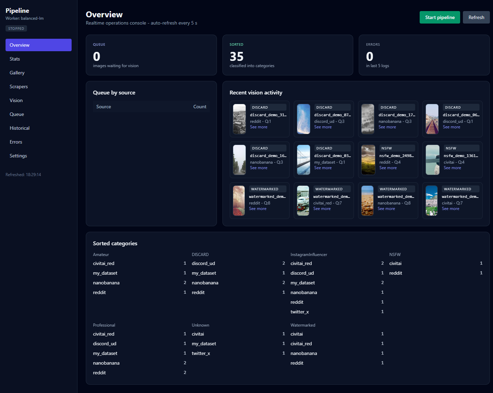
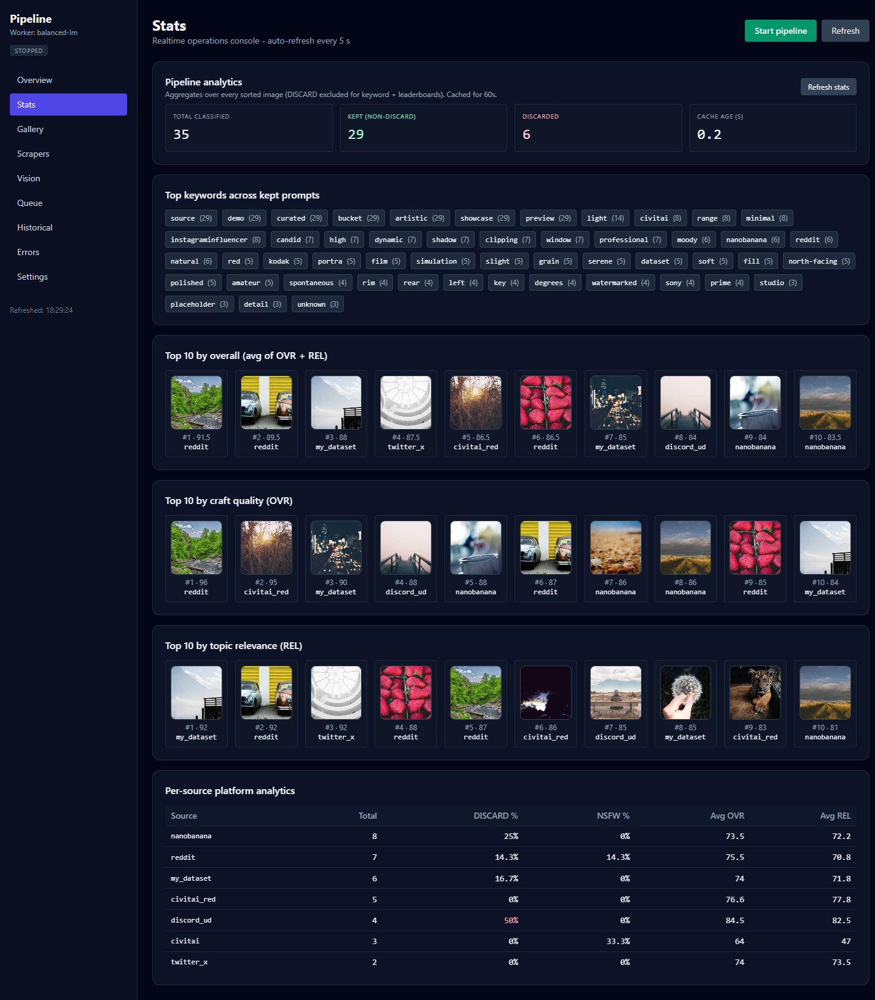
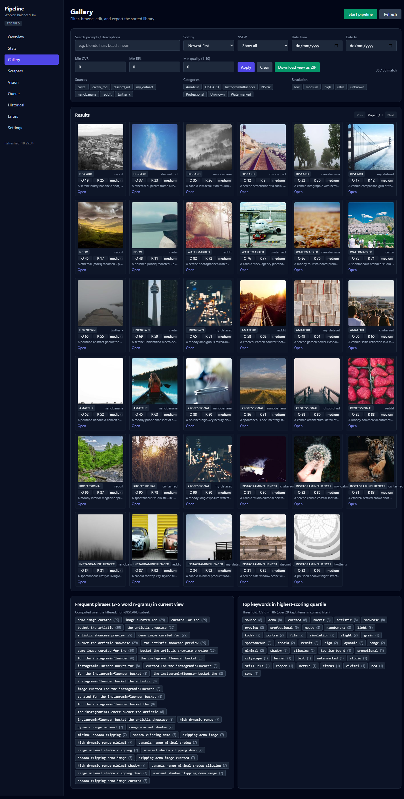
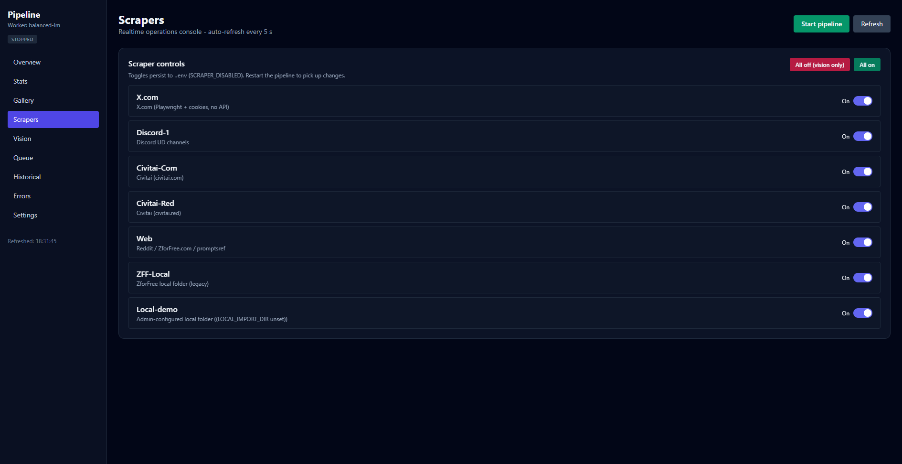

# Image Classification Pipeline

Multi-source image scraping → vision-model classification → organised asset library, with a Flask admin dashboard.

The pipeline pulls images from configurable sources (Civitai, X/Twitter, Reddit, Discord, local folders), runs them through a local or cloud vision model (LM Studio or Groq), and sorts them into category folders alongside the original prompt and a JSON record of the classification.

**Repo:** [`github.com/tlennon-ie/image-classification-pipeline`](https://github.com/tlennon-ie/image-classification-pipeline)
**License:** MIT

## Features

- **7+ scraper sources** — Civitai (.com + .red), X/Twitter, Reddit, Discord, ZForFree, web, generic local folder. Each toggleable from the dashboard.
- **Multiple vision backends** — LM Studio (local, with auto-detect), Groq cloud. JSON-schema constrained output so every backend returns the same shape.
- **Topic-aware filtering** — keyword + banned-word lists configurable per topic; every scraper respects them.
- **Live admin dashboard** at `http://localhost:5000` — start/stop pipeline, toggle scrapers/workers, browse the gallery, edit prompts, view stats and per-source analytics, export filtered ZIPs.
- **File-system queue** with atomic-rename locking — no Redis needed, but still safe for parallel workers.
- **Per-image audit trail** — every classified image keeps its `.txt` prompt and `.vision.json` (raw model output + post-hoc scoring) next to it.

## Quick start

The fastest path: clone, run the launcher, point a browser at `http://localhost:5000`.

### Linux / macOS

```bash
git clone https://github.com/tlennon-ie/image-classification-pipeline.git
cd image-classification-pipeline
./launch.sh
```

### Windows

```bat
git clone https://github.com/tlennon-ie/image-classification-pipeline.git
cd image-classification-pipeline
launch.bat
```

The launcher creates a virtual environment on first run (`.venv/`), installs dependencies from `requirements.txt`, copies `.env.example` to `.env` if you don't have one yet, then starts the dashboard.

### Manual setup (if you prefer)

```bash
git clone https://github.com/tlennon-ie/image-classification-pipeline.git
cd image-classification-pipeline

python -m venv .venv
source .venv/bin/activate          # Windows: .venv\Scripts\activate
pip install -r requirements.txt
python -m playwright install chromium   # only if using the X/Twitter or web scrapers

cp .env.example .env
# Edit .env: fill in API keys for the providers you'll use, leave the rest blank.

python pipeline_code/integrated_launcher.py
# Dashboard at http://localhost:5000
# Click "Start pipeline" once you've configured at least one scraper + vision worker.
```

By default the pipeline writes everything under `./data/` (queue, sorted, logs). Set `PIPELINE_BASE_DIR` in `.env` to put it elsewhere.

## Dashboard preview

The screenshots below are illustrative — they're rendered against a synthetic
"artistic showcase" dataset seeded by [`tools/seed_demo_data.py`](tools/seed_demo_data.py).
You can reproduce them on your own machine:

```bash
python tools/seed_demo_data.py            # downloads ~35 placeholder photos from picsum.photos
PIPELINE_TOPIC="Artistic Showcase" PIPELINE_SLUG=artistic_showcase \
  PIPELINE_BASE_DIR="$(pwd)/data" \
  PIPELINE_QUEUE="$(pwd)/data/queue/artistic_showcase" \
  PIPELINE_SORTED="$(pwd)/data/sorted/artistic_showcase" \
  FLASK_PORT=5050 \
  python pipeline_code/dashboard_enhanced.py
# then open http://localhost:5050
```

### Overview tab — at-a-glance pipeline state + recent activity



### Stats tab — keyword frequencies, top-10 leaderboards by metric, per-source analytics



### Gallery tab — filterable grid, n-gram insights, ZIP export of the current view



### Scrapers tab — one toggle per source, persists to `.env`



## Vision providers

The dashboard's **Vision** tab picks a worker; available options:

| Worker            | Endpoint              | Best for                                       |
|-------------------|-----------------------|------------------------------------------------|
| `balanced-lm`     | LM Studio (local)     | Privacy, no API costs, fastest if GPU is local |
| `lm-autodetect`   | LM Studio (local)     | Auto-pick whichever VL model is loaded         |
| `balanced-lm-secondary` | LM Studio (2nd) | Parallel throughput across two LM Studio hosts |
| `balanced-groq`   | Groq cloud            | Faster cold-start, handles NSFW                |

LM Studio needs to be running with a vision-language model loaded (e.g. `qwen2.5-vl-7b`, `qwen3-vl-8b`, `gemma-3-27b`, `llava-*`).

## Repository layout

```
pipeline_code/
├── run_pipeline.py            ← Supervisor: spawns scrapers + workers
├── integrated_launcher.py     ← Boots dashboard + pipeline together
├── dashboard_enhanced.py      ← Flask + Alpine.js admin UI (single file)
├── queue_manager.py           ← Atomic-rename queue, round-robin source picker
├── paths.py                   ← Single source of truth for filesystem paths
├── vision_prompt.py           ← Classification prompt + JSON schema + post-hoc scoring
├── vision_worker_balanced_lm.py
├── vision_worker_balanced_groq.py
├── vision_worker_lm_autodetect.py
├── vision_worker_lm_keepalive.py
├── scraper_civitai.py / scraper_civitai_search.py
├── scraper_discord.py
├── scraper_x.py
├── scraper_web.py
├── feed_local_folder.py / feed_zforfree_local.py
└── topic_filter.py            ← Keyword/topic gating shared by every scraper

data/                          ← Created on first run; ignored by git
├── queue/<slug>/<source>/     ← Images waiting to be classified
├── sorted/<slug>/<category>/<source>/  ← Classified output
└── logs/                      ← Pipeline + per-process logs
```

Per-image triple in `sorted/<slug>/<category>/<source>/`:

```
photo_msg-id_timestamp_nnn.jpg          ← image
photo_msg-id_timestamp_nnn.txt          ← prompt that generated it
photo_msg-id_timestamp_nnn.vision.json  ← model output + post-hoc scoring
```

## Dashboard tour

| Tab          | What's there                                                                  |
|--------------|-------------------------------------------------------------------------------|
| **Overview** | Queue/sorted totals, recent classifications, queue-by-source                  |
| **Stats**    | Top keywords, top-10 thumbnails by overall/quality/relevance, source analytics |
| **Gallery**  | Filterable grid (search, score, NSFW, date, source, category, resolution); ZIP export |
| **Scrapers** | Per-source on/off toggles                                                     |
| **Vision**   | Vision worker selection, throttle, LM Studio endpoint+model picker            |
| **Queue**    | Newest 60 queued items with thumbnails + prompts                              |
| **Historical** | Full classification history (newest 200), filterable                        |
| **Errors**   | Recent error log lines                                                        |
| **Settings** | Edit `.env`-backed values without touching the file                           |

The **Gallery** detail modal lets you edit the prompt and save (overwrites the `.txt` next to the image; no backup is kept).

## Configuration

All settings live in `.env`. The file is gitignored. Every variable is optional unless your enabled scrapers/workers require it. See `.env.example` for the full list with defaults.

Required only for the providers you plan to use:

- `GROQ_API_KEY` (for `balanced-groq`)
- `LMSTUDIO_PRIMARY_URL` (for `balanced-lm` / `lm-autodetect`; defaults to `http://127.0.0.1:1234`)
- `CIVITAI_API_KEY` (for the Civitai scrapers)
- `TWITTER_COOKIES` (for X/Twitter)
- `DISCORD_BOT_TOKEN` + `DISCORD_CHANNELS_JSON` (for Discord)

Quality thresholds:

- `VISION_OVR_MIN_SCORE` — minimum craft-quality score (0-100) below which images go to DISCARD
- `VISION_REL_MIN_SCORE` — minimum topic-relevance score (0-100); same threshold semantics

These don't apply to NSFW (which is always routed to its own folder when detected).

## Topic + categories

The default topic is `Realistic Female Influencer`, with categories `InstagramInfluencer / NSFW / Professional / Amateur / Unknown / Watermarked / DISCARD`. Change `PIPELINE_TOPIC` in `.env` to retarget; topic-derived keyword lists in `topic_filter.py` adapt automatically. Note: the post-hoc validation tokens in `vision_prompt.py` are still tuned for human-subject photography — for non-human topics you'll want to edit those.

## Architecture notes

- **No Redis required.** The queue is the filesystem; `<image>.processing` is the lock. A worker that crashes mid-flight is recovered by the supervisor's stale-`.processing` sweep on restart.
- **Structured output everywhere.** Every vision worker sends a `response_format` JSON schema with each request, so backends can't return free-form text. See `pipeline_code/vision_response_schema.json`.
- **Per-source dedup.** Each scraper keeps its own `seen_<source>_<slug>.json` index of already-fetched IDs.
- **Live `.env` reload.** Editing settings in the dashboard or restarting the pipeline picks up new env values; some structural changes (queue path, topic) require a full restart.

## Contributing

Small fixes welcome. For larger changes (new scraper source, new vision provider) please open an issue first — there's an active refactor planned to formalise the scraper and worker interfaces.

### Working with an AI coding agent

This repo ships with a Claude-style skill for AI agents at
[`.claude/skills/pipeline-helper/SKILL.md`](.claude/skills/pipeline-helper/SKILL.md)
and a high-level architecture brief at [`CLAUDE.md`](CLAUDE.md). Point Claude
Code, Cursor, Aider, Codex, or any agent that respects those files at the repo
and they'll know the load-bearing seams (categories module, vision-worker
registry, queue protocol, seen-store, credentials helpers) before touching
anything. The skill spells out which file to edit for each common task —
adding a scraper, adding a vision provider, changing thresholds, etc.

## License

MIT — see [LICENSE](LICENSE).
